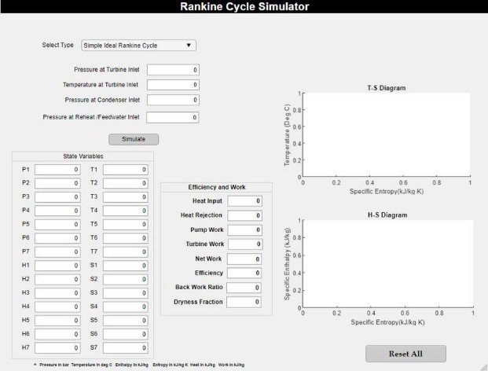

Aim- To develop a Rankine Cycle Simulator using MATLAB® 

Objectives- 

1. Inputs for Turbine Inlet and Outlet will be provided. 
1. Data entered will be used to find state points in the process. 
1. Graphs will be plotted between Temperature-Entropy (T-S) & Enthalpy-Entropy (H-S) 
1. Efficiency and other parameters will be computed based on the user input 

Introduction- 

Rankine Cycle: Ideal cycle for Vapour power cycles 

The Rankine cycle first developed in the year 1859 by Scottish Engineer William J.M. Rankine is a process in which the chemical energy of the fuel is converted to mechanical energy by superheating the steam in the boiler and then condensing it in the condenser. 

It consists of the following four processes-  

Process 1-2 is Isentropic Expansion in Turbine  

Process 2-3 is Constant Pressure Heat Rejection by Condenser  Process 3-4 is Isentropic Compression in Pump  

Process 4-1 is Constant Pressure heat Addition by Boiler 

Superheated Steam from the boiler enters the *turbine* at state 1, where it expands isentropically and produces work by rotating the shaft which is further connected to an electric generator. During expansion, the pressure and temperature of the steam drops to state 2 where steam enters the *condenser*. Here, the steam is in a saturated liquid-vapour mixture. Steam is condensed at constant pressure in the *condenser*. 

Steam leaves the condenser as saturated liquid and enters the *pump* and is compressed isentropically to the operating pressure of the *boiler*. Water enters the boiler as a compressed liquid at state 4 and leaves as superheated steam at state 1. 

The Rankine cycle can be analysed as a steady flow process. The boiler and condenser do not produce work, also the pump and the turbine are assumed to be isentropic. 

Thus, 

|**Component** |**Equation** |
| - | - |
|Pump |
= ℎ − ℎ

4 3
|
|Boiler |
= ℎ1 − ℎ

4
|
|Turbine |
= ℎ1 − ℎ

2
|
|Condenser |
= ℎ − ℎ

2 3
|
|Net Work |= −|
|Thermal Efficiency |
= 

ℎ 
|
|Back Work Ratio |=|

Increasing the efficiency of Rankine Cycle - 

Ideal Reheat Rankine Cycle- 

Reheating is done to improve the efficiency of the Rankine cycle. Here the expansion takes place in two stages i.e. first the steam is expanded isentropically by a high pressure turbine to an intermediate pressure and then sent back to the boiler where it gets reheated at constant pressure and then steam is sent to expand in the second stage by a low pressure turbine to the condenser pressure. 

Thus, the net-work output and heat input for the reheat case becomes

- ( − + − ) − ( − )** 
  - ( − + − )** 

Ideal Regenerative Rankine Cycle- 

From the T-S diagram it is clear that state (4-4’) a lot of heating goes on to bring the liquid up to    the boiling point at that pressure at a relatively low temperature, thus reducing heat- addition temperature and the cycle efficiency. 

To overcome this & to increase efficiency regeneration is used where we try to increase the temperature of the liquid leaving the pump before entering the boiler. This is achieved by bleeding or extracting steam from the turbine at various points to heat the feedwater *(water to be supplied to a boiler for conversion into steam)* inside a feedwater heater. 

Feedwater inside the heater can be heated in two ways- 

- Open Feedwater Heater- here the steam extracted from the turbine mixes with the feedwater exiting the pump, the mixture leaves the heater as a saturated liquid at the heater pressure. 

  

- Closed Feedwater Heater-here heat is transferred from the extracted steam to the feedwater without mixing 

  

In the Rankine Regenerative cycle steam enters the turbine at (1) and expands isentropically in the turbine till the point (2) where it is extracted. At state (2) some amount of heat is taken and fed to the feedwater heater while the rest steam continues to expand in the turbine till it reaches the condenser pressure at point (3). From the condenser the steam leaves as saturated liquid at condenser pressure (4). The feedwater enters into the open feedwater heater via pump (1) where it mixes with the steam extracted from turbine at (2). The mixture leaves the heater as saturated liquid at heater pressure (6). Pump (2) raises the feedwater heater pressure to boiler pressure (7), inside the boiler phase change from water to steam occurs and then superheating of steam takes place. 

If boiler generates 1 kg of steam and m kg of steam is extracted at (2) so (1-m) kg steam expands completely. 

- −
- − ( − )** 
- − + − ( − )** 
- − ( − )+ −

MATLAB Implementation- 

To make the simulator, MATLAB App Designer was used along with MATLAB scripts in this project. All the scripts, functions and apps of this project are available on my GitHub link for the latter is given below- 

[GitHub Repository Link... ](https://github.com/mastersinusoidal/Rankine-Cycle-Simulator)

Code Explanation- 

[**https://github.com/mastersinusoidal/Rankine-Cycle-Simulator/blob/main/rankine_cycle_simulator.m** ](https://github.com/mastersinusoidal/Rankine-Cycle-Simulator/blob/main/rankine_cycle_simulator.m)

- First, Input parameters were asked from user to parameterise the simulator. 

clear all                               % Clears command history close all                               % Closes  all windows 

clc                                     % Clears command window 

- Basic Info 

fprintf('%60s rn', 'Rankine Cycle Simulator') 

fprintf('%s n','Process 1-2 is Isentropic Expansion in Turbine') 

fprintf('%s n','Process 2-3 is Constant Pressure Heat Rejection by Condenser') fprintf('%s n','Process 3-4 is Isentropic Compression in Pump') 

fprintf('%s rn','Process 4-1 is Constant Pressure heat Addition by Boiler') 

%% INPUTS 

p1=input('Enter the pressure at turbine Inlet : '); t1=input('Enter the temperature at turbine Inlet : '); p2=input('Enter the pressure at condensor Inlet : '); 

- State points properties (Pressure, Temperature, Entropy, Enthapy) are calculated based on the values from the XSteam.m file. 

%% 1-2 Isentropic Turbine Expansion 

h1=XSteam('h\_pT',p1,t1);  

s1=XSteam('s\_pT',p1,t1); 

tsat1=XSteam('Tsat\_p',p1);     %Saturation Temp.at p1  hg1=XSteam('hV\_p',p1); 

hf1=XSteam('hL\_p',p1); 

sg1=XSteam('sV\_p',p1); 

sf1=XSteam('sL\_p',p1); 

s2=s1; 

hf2=XSteam('hL\_p',p2); 

sf3=XSteam('sL\_p',p2); 

hg2=XSteam('hV\_p',p2); 

sg2=XSteam('sV\_p',p2); 

sfg=sg2-sf3;                    %entropy of wet region 

hfg= hg2-hf2; 

if s2 < sg2                     % Checks to see if Point 2 is within the vapor dome      x2=(s2-sf3)/sfg;           % calculates the new quality at this point 

`     `h2=hf2+x2\*hfg;             % calculates the new enthalpy      

else 

`     `x2 = 1;                    % Quality is max 1 

`     `h2 = x2\*hg2;               % calculates the new enthalpy 

end 

t2=XSteam('T\_ps',p2,s2); 

tsat2=XSteam('Tsat\_p',p2);      %Saturation Temp.at p2 

%% 2-3 Isobaric Condenser 

p3=p2; 

s3=sf3; 

h3=hf2; 

%% 3-4 Isentropic Pump 

s4=s3; 

t3=tsat2; 

%% 4-1 Isobaric Boiler 

p4=p1; 

h4=XSteam('h\_ps',p4,s4); 

t4=XSteam('T\_ps',p4,s4);

- Property Diagrams (T-S & H-S) are animated and drawn next using animatedline and plot functions.**        

%% T-S & H-S Diagrams t= linspace(1,t1,5000); 

figure(1) 

hold on 

sl=zeros; 

sv=zeros; 

hl=zeros; 

hv=zeros; 

for i=1:length(t) 

`    `sl(i)=XSteam('sL\_T',t(i));     sv(i)=XSteam('sV\_T',t(i));     hl(i)=XSteam('hL\_T',t(i));     hv(i)=XSteam('hV\_T',t(i)); 

end  plot(sl,t,'--r','linewidth',1) plot(sv,t,'--r','linewidth',1) %% T-S Diagram Animation for i=s1:s2 

`    `a=linspace(s1,s2,100); 

`    `b=linspace(t1,t2,100); 

`    `curve=animatedline('color','c','linewidth',2);     for j=1:100 

`        `x=a(j); 

`        `y=b(j); 

`        `addpoints(curve,x,y); 

`        `pause(0.01) ;   

`    `end 

end 

for i=sg2:s2 

`    `a=linspace(s2,sg2,100); 

`    `b=linspace(t2,tsat2,100); 

`    `curve=animatedline('color','c','linewidth',2);     for j=1:100 

`        `x=a(j); 

`        `y=b(j); 

`        `addpoints(curve,x,y); 

`        `pause(0.01) ;   

`    `end 

end 

for i=s3:sg2 

`    `a=linspace(sg2,s3,100); 

`    `b=linspace(tsat2,t3,100); 

`    `curve=animatedline('color','c','linewidth',2);     for j=1:100 

`        `x=a(j); 

`        `y=b(j); 

`        `addpoints(curve,x,y); 

`        `pause(0.01) ;   

`    `end 

end 

for i=s3:s4 

`    `a=linspace(s3,s4,100); 

`    `b=linspace(t3,t4,100); 

`    `curve=animatedline('color','c','linewidth',2); 

`    `for j=1:100 

`        `x=a(j); 

`        `y=b(j); 

`        `addpoints(curve,x,y); 

`        `pause(0.01) ;   

`    `end 

end 

for i=s4:sf1 

`    `a=linspace(s4,sf1,100); 

`    `b=linspace(t4,tsat1,100); 

`    `curve=animatedline('color','c','linewidth',2);     for j=1:100 

`        `x=a(j); 

`        `y=b(j); 

`        `addpoints(curve,x,y); 

`        `pause(0.01) ;   

`    `end 

end 

for i=sf1:sg1 

`    `a=linspace(sf1,sg1,100); 

`    `b=linspace(tsat1,tsat1,100); 

`    `curve=animatedline('color','c','linewidth',2);     for j=1:100 

`        `x=a(j); 

`        `y=b(j); 

`        `addpoints(curve,x,y); 

`        `pause(0.01) ;   

`    `end 

end 

for i=sg1:s1 

`    `a=linspace(sg1,s1,100); 

`    `b=linspace(tsat1,t1,100); 

`    `curve=animatedline('color','c','linewidth',2);     for j=1:100 

`        `x=a(j); 

`        `y=b(j); 

`        `addpoints(curve,x,y); 

`        `pause(0.01) ;   

`    `end 

end 

% 

%plot([s1 s2],[t1 t2],'linewidth',2) 

%plot([s2 sg2],[t2 tsat2],'linewidth',2) %plot([sg2 s3],[tsat2 t3],'linewidth',2) %plot([s3 s4],[t3 t4],'linewidth',2) 

%plot([s4 sf1],[t4 tsat1],'linewidth',2) %plot([sf1 sg1],[tsat1 tsat1],'linewidth',2) %plot([sg1 s1],[tsat1 t1],'linewidth',2) 

xlabel({'Specific Entropy [S] ','(kJ/kg K)'},'FontWeight','bold') ylabel({'Temperature [T] ','(Deg C)'},'FontWeight','bold') 

%% H-S Diagram Animation figure(2) 

hold on 

plot([s1 s2],[h1 h2],'linewidth',2) plot([s2 s3],[h2 h3],'linewidth',2) plot([s3 s4],[h3 h4],'linewidth',2) plot([s4 sf1],[h4 hf1],'linewidth',2) plot([sf1 sg1],[hf1 hg1],'linewidth',2) plot([sg1 s1],[hg1 h1],'linewidth',2) plot([sl sv],[hl hv],'--r','linewidth',1) 

xlabel({'Specific Entropy [S] ','(kJ/kg K)'},'FontWeight','bold') ylabel({'Specific Enthalpy [H] ' ,'(kJ/kg)'},'FontWeight','bold') 

- Now, the work and efficiency of the are calculated using the mathematical relations. 

%% Efficiency and Work 

Wt=h1-h2; Wp=h4-h3; W=Wt-Wp; 

qin=h1-h4; qout=h2-h3; 

eff=W\*100/qin; bwr=qin/qout;

- Finally the output and all the calculated values are displayed on the command window. 

%% Display 

fprintf('%-60s %20s rn', 'At State Point 1','At State Point 2' ) 

fprintf('%s %.2f %s %64s %.2f %s n','P1:',p1,'bar','P2:',p2,'bar') 

fprintf('%s %.2f %s %55s %.2f %s n','T1:',t1,'deg Celcius','T2:',t2,'deg Celcius') fprintf('%s %.2f %s %60s %.2f %s n','H1:',h1,'kJ/Kg','H2:',h2,'kJ/Kg') fprintf('%s %.2f %s %61s %.2f %s rn','S1:',s1,'kJ/Kg K','S2:',s2,'kJ/Kg K') fprintf('%-60s %20s rn', 'At State Point 3','At State Point 4' ) 

fprintf('%s %.2f %s %64s %.2f %s n','P3:',p3,'bar','P4:',p4,'bar') 

fprintf('%s %.2f %s %55s %.2f %s n','T3:',t3,'deg Celcius','T3:',t4,'deg Celcius') fprintf('%s %.2f %s %60s %.2f %s n','H3:',h3,'kJ/Kg','H4:',h4,'kJ/Kg') fprintf('%s %.2f %s %60s %.2f %s rn','S3:',s3,'kJ/Kg K','S4:',s4,'kJ/Kg K') fprintf('%60s %.2f %s n','Work Done by Turbine:',Wt,'kJ/Kg') 

fprintf('%60s %.2f %s n','Work Done by Pump:',Wp,'kJ/Kg') 

fprintf('%60s %.2f %s n','Net Work Done:',W,'kJ/Kg') 

fprintf('%60s %.2f %s n','Heat Input in boiler:',qin,'kJ/Kg') 

fprintf('%60s %.2f %s n','Heat rejected in Condenser:',qout,'kJ/Kg') fprintf('%60s %.2f n','Back Work Ratio:',bwr)

Function **rankine\_cycle\_reheat.m-** 

[**https://github.com/mastersinusoidal/Rankine-Cycle-Simulator/blob/main/rankine_cycle_reheat.m** ](https://github.com/mastersinusoidal/Rankine-Cycle-Simulator/blob/main/rankine_cycle_reheat.m)

- For Reheat Rankine cycle a function ***rankine\_cycle\_reheat*** was created. This function takes pressure at turbine inlet, temperature at turbine inlet, pressure at condenser inlet and pressure at reheat as inputs. And this also follows the same methedology like the above simple rankine cycle code, first it finds the state point properties then plots the 

  points and calculates the thermal efficiency & work.  

function [eff]=rankine\_cycle\_reheat(t1,p1,p2,p3) t= linspace(1,t1,5000); 

figure(1) 

hold on 

sl=zeros; 

sv=zeros; 

hl=zeros; 

hv=zeros; 

for i=1:length(t) 

`    `sl(i)=XSteam('sL\_T',t(i));     sv(i)=XSteam('sV\_T',t(i));     hl(i)=XSteam('hL\_T',t(i));     hv(i)=XSteam('hV\_T',t(i)); 

end  plot(sl,t,'--r','linewidth',1) plot(sv,t,'--r','linewidth',1) 

h1 = XSteam('h\_pT',p1,t1); s1 = XSteam('s\_pT',p1,t1); 

s2=s1; h2=XSteam('h\_pS',p2,s2); t2=XSteam('T\_hs',h2,s2); 

h3=XSteam('h\_pT',p3,t1); s3=XSteam('s\_pT',p3,t1); t3=t1; 

s4=s3; hf4=XSteam('hL\_p',p3); sf4=XSteam('sL\_p',p3); hg4=XSteam('hV\_p',p3); 

sg4=XSteam('sV\_p',p3); sfg=sg4-sf4;                     hfg= hg4-hf4; 

if s4

Function **rankine\_cycle\_regeneration.m-** 

[**https://github.com/mastersinusoidal/Rankine-Cycle-Simulator/blob/main/rankine_cycle_regeneration.m** ](https://github.com/mastersinusoidal/Rankine-Cycle-Simulator/blob/main/rankine_cycle_regeneration.m)

- Similarly the regenerative rankine cycle is also implemented in the same way.          

function [eff]=rankine\_cycle\_regeneration(t1,p1,p2,p3) t= linspace(1,t1,5000); 

figure(1) 

hold on 

sl=zeros; 

sv=zeros; 

hl=zeros; 

hv=zeros; 

for i=1:length(t) 

`    `sl(i)=XSteam('sL\_T',t(i));     sv(i)=XSteam('sV\_T',t(i));     hl(i)=XSteam('hL\_T',t(i));     hv(i)=XSteam('hV\_T',t(i)); 

end  plot(sl,t,'--r','linewidth',1) plot(sv,t,'--r','linewidth',1) 

h1 = XSteam('h\_pT',p1,t1); s1 = XSteam('s\_pT',p1,t1); 

s2=s1; h2=XSteam('h\_pS',p2,s2); t2=XSteam('T\_hs',h2,s2); 

tsat3=XSteam('Tsat\_p',p3); 

hf3=XSteam('hL\_p',p3); 

sf3=XSteam('sL\_p',p3); 

hg3=XSteam('hV\_p',p3); 

sg3=XSteam('sV\_p',p3); 

sfg=sg3-sf3;                    %entropy of wet region 

hfg= hg3-hf3; 

if s2 < sg3                     % Checks to see if Point 2 is within the vapor dome      x2=(s2-sf3)/sfg;           % calculates the new quality at this point 

`     `h3=hf3+x2\*hfg;             % calculates the new enthalpy      

else 

`     `x2 = 1;                    % Quality is max 1 

`     `h3 = x2\*hg3;               % calculates the new enthalpy 

end 

s3=s2; 

s4=XSteam('sL\_p',p3); hf4=XSteam('hL\_p',p3); sf4=XSteam('sL\_p',p3); 

hg4=XSteam('hV\_p',p3); sg4=XSteam('sV\_p',p3); sfg=sg4-sf4;  

h4= hf4; 

tsat4=XSteam('Tsat\_p',p3); t4=XSteam('T\_hs',h4,s4); 

v4=XSteam('vL\_p',p3); p4=p3; 

p5=p2; h5=h4+v4\*((p5-p4)\*100); 

s5=s4; t5=t4; 

s6=XSteam('sL\_p',p2); s7=s6; 

p6=p1; t6=XSteam('T\_ps',p6,s6); h6=XSteam('h\_pS',p6,s6); sg1=XSteam('sV\_p',p1); hg1=XSteam('hV\_p',p1); sf1=XSteam('sL\_p',p1); hf1=XSteam('hL\_p',p1); tsat1=XSteam('Tsat\_p',p1); 

tsat2=XSteam('Tsat\_p',p2); t6=tsat2; sg2=XSteam('sV\_p',p2); hg2=XSteam('hV\_p',p2); sf2=XSteam('sL\_p',p2); hf2=XSteam('hL\_p',p2); 

t7=XSteam('T\_ps',p1,sf2); t5=XSteam('T\_ps',p3,s5); 

v7=XSteam('vL\_p',p1); h7=h6+v7\*((p1-p2)\*100); 

m=(h6-h5)/(h2-h5); hold on 

plot([s1 s2],[t1 t2],'linewidth',2) plot([s2 sg2],[t2 tsat2],'linewidth',2) plot([sg2 sf2],[tsat2 tsat2],'linewidth',2) plot([sf2 sf2],[t6 t7],'linewidth',2) plot([s2 s3],[t2 tsat3],'linewidth',2) plot([s3 s4],[tsat3 tsat3],'linewidth',2) plot([s4 s5],[tsat3 t5],'linewidth',2) plot([s5 s6],[t5 tsat2],'linewidth',2) plot([s6 s7],[t6 t7],'linewidth',2) 

plot([s7 sf1],[t7 tsat1],'linewidth',2) 

plot([sf1 sg1],[tsat1 tsat1],'linewidth',2) 

plot([sg1 s1],[tsat1 t1],'linewidth',2) 

xlabel({'Specific Entropy [S] ','(kJ/kg K)'},'FontWeight','bold') ylabel({'Temperature [T] ','(Deg C)'},'FontWeight','bold') 

figure(2) hold on 

plot([s1 s2],[h1 h2],'linewidth',2) 

plot([s2 sg2],[h2 hg2],'linewidth',2) 

plot([sg2 sf2],[hg2 hf2],'linewidth',2) 

plot([sf2 sf2],[h6 h7],'linewidth',2) 

plot([s2 s3],[h2 h3],'linewidth',2) 

plot([s3 s4],[h3 h4],'linewidth',2) 

plot([s4 s5],[h4 h5],'linewidth',2) 

plot([s5 s6],[h5 h6],'linewidth',2) 

plot([s6 s7],[h6 h7],'linewidth',2) 

plot([s7 sf1],[h7 hf1],'linewidth',2) 

plot([sf1 sg1],[hf1 hg1],'linewidth',2) 

plot([sg1 s1],[hg1 h1],'linewidth',2) 

plot([sl sv],[hl hv],'--r','linewidth',1) 

xlabel({'Specific Entropy [S] ','(kJ/kg K)'},'FontWeight','bold') ylabel({'Specific Enthalpy [H] ' ,'(kJ/kg)'},'FontWeight','bold') 

Wp = (1-m)\*(h5-h4)+(h7-h6); Wt = (h1-h2)+(1-m)\*(h2-h3); qin = h1-h7; qout=(1-m)\*h3-h4; W=Wt-Wp; 

eff = (W/qin); 

bwr=Wp/Wt; 

end 

Output- 

Type the following command to execute reheat rankine cycle. rankine\_cycle\_reheat(538,44,12,5.58)

Type the command to execute the regenerative rankine cycle. rankine\_cycle\_regeneration(538,44,12,5.58)

Rankine Cycle Simulator App using MATLAB App Designer- 

[https://github.com/mastersinusoidal/Rankine-Cycle-Simulator/blob/main/rankine_app.mlapp ](https://github.com/mastersinusoidal/Rankine-Cycle-Simulator/blob/main/rankine_app.mlapp)

This Simulator simulates three Rankine cycles viz. Simple, Reheat, Regeneration that the user can select from the drop down menu. 

After Selecting the Cycle type next the user needs to input some data in order to parameterise the simulator, then click on Simulate button. 

The Reset All button resets the app to let the user simulate for other parameters. This reset like behaviour is achieved by closing the app and opening a new instance for this a callback function was created that hides the currently running instance , opens a second instance with default values, and then deletes the first one. 

`        `function ResetAllButtonPushed(app, event)             app.UIFigure.Visible='off';           

`            `rankine\_app();   

`            `close(app.UIFigure) 

`        `end

Output- 

App Code- 

[https://github.com/mastersinusoidal/Rankine-Cycle-Simulator/blob/main/rankine_app_exported.m ](https://github.com/mastersinusoidal/Rankine-Cycle-Simulator/blob/main/rankine_app_exported.m)

classdef rankine\_app\_exported < matlab.apps.AppBase 

- Properties that correspond to app components 

`    `properties (Access = public) 

`        `UIFigure                       matlab.ui.Figure 

`        `RankineCycleSimulatorLabel     matlab.ui.control.Label 

`        `PressureatTurbineInletEditFieldLabel  matlab.ui.control.Label 

`        `PressureatTurbineInletEditField  matlab.ui.control.NumericEditField 

`        `TemperatureatTurbineInletEditFieldLabel  matlab.ui.control.Label 

`        `TemperatureatTurbineInletEditField  matlab.ui.control.NumericEditField         PressureatCondenserInletEditFieldLabel  matlab.ui.control.Label 

`        `PressureatCondenserInletEditField  matlab.ui.control.NumericEditField         StateVariablesPanel            matlab.ui.container.Panel 

`        `GridLayout                     matlab.ui.container.GridLayout 

`        `P1EditFieldLabel               matlab.ui.control.Label 

`        `P1                             matlab.ui.control.NumericEditField 

`        `P2EditFieldLabel               matlab.ui.control.Label 

`        `P2                             matlab.ui.control.NumericEditField 

`        `P3EditFieldLabel               matlab.ui.control.Label 

`        `P3                             matlab.ui.control.NumericEditField 

`        `P4EditFieldLabel               matlab.ui.control.Label 

`        `P4                             matlab.ui.control.NumericEditField 

`        `P5EditFieldLabel               matlab.ui.control.Label 

`        `P5                             matlab.ui.control.NumericEditField 

`        `P6EditFieldLabel               matlab.ui.control.Label 

`        `P6                             matlab.ui.control.NumericEditField 

`        `P7EditFieldLabel               matlab.ui.control.Label 

`        `P7                             matlab.ui.control.NumericEditField 

`        `T1Label                        matlab.ui.control.Label 

`        `T1                             matlab.ui.control.NumericEditField 

`        `T2Label                        matlab.ui.control.Label 

`        `T2                             matlab.ui.control.NumericEditField 

`        `T3Label                        matlab.ui.control.Label 

`        `T3                             matlab.ui.control.NumericEditField 

`        `T4Label                        matlab.ui.control.Label 

`        `T4                             matlab.ui.control.NumericEditField 

`        `T5Label                        matlab.ui.control.Label 

`        `T5                             matlab.ui.control.NumericEditField 

`        `T6Label                        matlab.ui.control.Label 

`        `T6                             matlab.ui.control.NumericEditField 

`        `T7Label                        matlab.ui.control.Label 

`        `T7                             matlab.ui.control.NumericEditField 

`        `H1EditFieldLabel               matlab.ui.control.Label 

`        `H1                             matlab.ui.control.NumericEditField 

`        `H2EditFieldLabel               matlab.ui.control.Label 

`        `H2                             matlab.ui.control.NumericEditField 

`        `H3EditFieldLabel               matlab.ui.control.Label 

`        `H3                             matlab.ui.control.NumericEditField 

`        `H4EditFieldLabel               matlab.ui.control.Label 

`        `H4                             matlab.ui.control.NumericEditField 

H5EditFieldLabel               matlab.ui.control.Label 

H5                             matlab.ui.control.NumericEditField H6EditFieldLabel               matlab.ui.control.Label 

H6                             matlab.ui.control.NumericEditField 

H7EditFieldLabel               matlab.ui.control.Label 

H7                             matlab.ui.control.NumericEditField S1EditFieldLabel               matlab.ui.control.Label 

S1                             matlab.ui.control.NumericEditField S2EditFieldLabel               matlab.ui.control.Label 

S2                             matlab.ui.control.NumericEditField S3EditFieldLabel               matlab.ui.control.Label 

S3                             matlab.ui.control.NumericEditField S4EditFieldLabel               matlab.ui.control.Label 

S4                             matlab.ui.control.NumericEditField S5EditFieldLabel               matlab.ui.control.Label 

S5                             matlab.ui.control.NumericEditField S6EditFieldLabel               matlab.ui.control.Label 

S6                             matlab.ui.control.NumericEditField S7EditFieldLabel               matlab.ui.control.Label 

S7                             matlab.ui.control.NumericEditField 

UIAxes                         matlab.ui.control.UIAxes 

UIAxes\_2                       matlab.ui.control.UIAxes 

SimulateButton                 matlab.ui.control.Button 

EfficiencyandWorkPanel         matlab.ui.container.Panel HeatInputEditFieldLabel        matlab.ui.control.Label 

HeatInputEditField             matlab.ui.control.NumericEditField HeatRejectionEditFieldLabel    matlab.ui.control.Label HeatRejectionEditField         matlab.ui.control.NumericEditField PumpWorkEditFieldLabel         matlab.ui.control.Label 

PumpWorkEditField              matlab.ui.control.NumericEditField TurbineWorkEditFieldLabel      matlab.ui.control.Label 

TurbineWorkEditField           matlab.ui.control.NumericEditField NetWorkEditFieldLabel          matlab.ui.control.Label 

NetWorkEditField               matlab.ui.control.NumericEditField EfficiencyEditFieldLabel       matlab.ui.control.Label 

EfficiencyEditField            matlab.ui.control.NumericEditField BackWorkRatioEditFieldLabel    matlab.ui.control.Label BackWorkRatioEditField         matlab.ui.control.NumericEditField DrynessFractionEditFieldLabel  matlab.ui.control.Label DrynessFractionEditField       matlab.ui.control.NumericEditField PressureinbarLabel             matlab.ui.control.Label 

TemperatureindegCLabel         matlab.ui.control.Label 

EnthalpyinkJkgLabel            matlab.ui.control.Label 

EntropyinkJkgKLabel            matlab.ui.control.Label 

HeatinkJkgLabel                matlab.ui.control.Label 

WorkinkJkgLabel                matlab.ui.control.Label 

Label                          matlab.ui.control.Label 

SelectTypeDropDownLabel        matlab.ui.control.Label 

rankinedropdown                matlab.ui.control.DropDown PressureatReheatFeedwaterInletEditFieldLabel  matlab.ui.control.Label PressureatReheatFeedwaterInletEditField  matlab.ui.control.NumericEditField 

`        `ResetAllButton                 matlab.ui.control.Button     end 

methods (Access = private) end 

methods (Access = public) 

end 

- Callbacks that handle component events methods (Access = private) 
  - Button pushed function: SimulateButton function SimulateButtonPushed(app, event) 

if strcmp(app.rankinedropdown.Value,'Simple Ideal Rankine Cycle') 

p1=app.PressureatTurbineInletEditField.Value; t1=app.TemperatureatTurbineInletEditField.Value; p2=app.PressureatCondenserInletEditField.Value; 

h1=XSteam('h\_pT',p1,t1);  s1=XSteam('s\_pT',p1,t1); tsat1=XSteam('Tsat\_p',p1);     hg1=XSteam('hV\_p',p1); hf1=XSteam('hL\_p',p1); sg1=XSteam('sV\_p',p1); sf1=XSteam('sL\_p',p1); 

`                `s2=s1; 

`                `hf2=XSteam('hL\_p',p2); 

`                `sf3=XSteam('sL\_p',p2); 

`                `hg2=XSteam('hV\_p',p2); 

`                `sg2=XSteam('sV\_p',p2); 

`                `sfg=sg2-sf3;                     

`                `hfg= hg2-hf2; 

`                `if s2 < sg2                   

`                     `x2=(s2-sf3)/sfg;            

`                     `h2=hf2+x2\*hfg;                                   else 

`                     `x2 = 1;                     

`                     `h2 = x2\*hg2;                

`                `end 

`                `t2=XSteam('T\_ps',p2,s2); 

`                `tsat2=XSteam('Tsat\_p',p2);       

p3=p2; s3=sf3; h3=hf2; 

s4=s3; t3=tsat2; 

p4=p1; h4=XSteam('h\_ps',p4,s4); t4=XSteam('T\_ps',p4,s4); 

t= linspace(1,t1,5000); 

`                `sl=zeros; 

`                `sv=zeros; 

`                `hl=zeros; 

`                `hv=zeros; 

`                `for i=1:length(t) 

`                    `sl(i)=XSteam('sL\_T',t(i)); 

sv(i)=XSteam('sV\_T',t(i)); hl(i)=XSteam('hL\_T',t(i)); hv(i)=XSteam('hV\_T',t(i)); 

end  

hold(app.UIAxes,'on') 

plot([s1 s2],[t1 t2],'linewidth',2,'color','k','Parent',app.UIAxes) plot([s2 sg2],[t2 tsat2],'linewidth',2,'color','k','Parent',app.UIAxes) plot([sg2 s3],[tsat2 t3],'linewidth',2,'color','k','Parent',app.UIAxes) plot([s3 s4],[t3 t4],'linewidth',2,'color','k','Parent',app.UIAxes) plot([s4 sf1],[t4 tsat1],'linewidth',2,'color','k','Parent',app.UIAxes) plot([sf1 sg1],[tsat1 tsat1],'linewidth',2,'color','k','Parent',app.UIAxes) plot([sg1 s1],[tsat1 t1],'linewidth',2,'color','k','Parent',app.UIAxes) plot(sl,t,'--r','linewidth',1,'Parent',app.UIAxes) plot(sv,t,'--r','linewidth',1,'Parent',app.UIAxes) 

hold(app.UIAxes\_2,'on') 

plot([s1 s2],[h1 h2],'linewidth',2,'color','k','Parent',app.UIAxes\_2) plot([s2 sg2],[h2 hg2],'linewidth',2,'color','k','Parent',app.UIAxes\_2) plot([sg2 s3],[hg2 h3],'linewidth',2,'color','k','Parent',app.UIAxes\_2) plot([s3 s4],[h3 h4],'linewidth',2,'color','k','Parent',app.UIAxes\_2) plot([s4 sf1],[h4 hf1],'linewidth',2,'color','k','Parent',app.UIAxes\_2) plot([sf1 sg1],[hf1 hg1],'linewidth',2,'color','k','Parent',app.UIAxes\_2) plot([sg1 s1],[hg1 h1],'linewidth',2,'color','k','Parent',app.UIAxes\_2) plot([sl sv],[hl hv],'--r','linewidth',1,'Parent',app.UIAxes\_2) 

Wt=h1-h2; Wp=h4-h3; W=Wt-Wp; qin=h1-h4; qout=h2-h3; eff=W\*100/qin; bwr=qin/qout; 

app.BackWorkRatioEditField.Value=bwr; app.HeatInputEditField.Value=qin; app.HeatRejectionEditField.Value=qout; app.EfficiencyEditField.Value=eff; app.TurbineWorkEditField.Value=Wt; app.PumpWorkEditField.Value=Wp; app.DrynessFractionEditField.Value=x2; app.NetWorkEditField.Value=W; 

app.P1.Value=p1; app.P2.Value=p2; app.P3.Value=p3; app.P4.Value=p4; 

app.T1.Value=t1; app.T2.Value=t2; app.T3.Value=t3; 

app.T4.Value=t4; 

app.H1.Value=h1; app.H2.Value=h2; app.H3.Value=h3; app.H4.Value=h4; 

app.S1.Value=s1; app.S2.Value=s2; app.S3.Value=s3; app.S4.Value=s4; 

`            `elseif strcmp(app.rankinedropdown.Value,'Ideal Rankine Cycle with Regeneration')                 p1=app.PressureatTurbineInletEditField.Value; 

`                `t1=app.TemperatureatTurbineInletEditField.Value; 

`                `p3=app.PressureatCondenserInletEditField.Value; 

`                `p2=app.PressureatReheatFeedwaterInletEditField.Value; 

`                `t= linspace(1,t1,5000); 

`                `sl=zeros; 

`                `sv=zeros; 

`                `hl=zeros; 

`                `hv=zeros; 

`                `for i=1:length(t) 

`                    `sl(i)=XSteam('sL\_T',t(i));                     sv(i)=XSteam('sV\_T',t(i));                     hl(i)=XSteam('hL\_T',t(i));                     hv(i)=XSteam('hV\_T',t(i)); 

end  

hold(app.UIAxes,'on') plot(sl,t,'--r','linewidth',1,'Parent',app.UIAxes) plot(sv,t,'--r','linewidth',1,'Parent',app.UIAxes) 

h1 = XSteam('h\_pT',p1,t1); s1 = XSteam('s\_pT',p1,t1); 

s2=s1; h2=XSteam('h\_pS',p2,s2); t2=XSteam('T\_hs',h2,s2); t3=XSteam('T\_ps',p3,s2); 

app.S2.Value=s2; app.H2.Value=h2; app.T2.Value=t2; 

tsat3=XSteam('Tsat\_p',p3); 

`                `hf3=XSteam('hL\_p',p3); 

`                `sf3=XSteam('sL\_p',p3); 

`                `hg3=XSteam('hV\_p',p3); 

`                `sg3=XSteam('sV\_p',p3); 

`                `sfg=sg3-sf3;                    

`                `hfg= hg3-hf3; 

`                `if s2 < sg3                      

`                     `x2=(s2-sf3)/sfg;           

`                     `h3=hf3+x2\*hfg;                                   else 

`                     `x2 = 1;                     

`                     `h3 = x2\*hg3;                

end 

s3=s2; app.S3.Value=s3; 

s4=XSteam('sL\_p',p3); hf4=XSteam('hL\_p',p3); sf4=XSteam('sL\_p',p3); hg4=XSteam('hV\_p',p3); sg4=XSteam('sV\_p',p3); sfg=sg4-sf4;  

h4= hf4; tsat4=XSteam('Tsat\_p',p3); t4=XSteam('T\_hs',h4,s4); 

app.S4.Value=s4; app.H4.Value=h4; app.T4.Value=t4; 

v4=XSteam('vL\_p',p3); p4=p3; 

p5=p2; h5=h4+v4\*((p5-p4)\*100); app.H5.Value=h5; app.P4.Value=p4; app.P5.Value=p5; app.H5.Value=h5; 

s5=s4; 

t5=t4; app.S5.Value=s5; app.T5.Value=t5; 

s6=XSteam('sL\_p',p2); s7=s6; 

p6=p1; t6=XSteam('T\_ps',p6,s6); h6=XSteam('h\_pS',p6,s6); sg1=XSteam('sV\_p',p1); hg1=XSteam('hV\_p',p1); sf1=XSteam('sL\_p',p1); hf1=XSteam('hL\_p',p1); tsat1=XSteam('Tsat\_p',p1); app.S6.Value=s6; app.S7.Value=s7; app.S6.Value=s6; app.T6.Value=t6; app.H6.Value=h6; 

tsat2=XSteam('Tsat\_p',p2); t6=tsat2; sg2=XSteam('sV\_p',p2); hg2=XSteam('hV\_p',p2); sf2=XSteam('sL\_p',p2); hf2=XSteam('hL\_p',p2); t7=XSteam('T\_ps',p1,sf2); app.T7.Value=t7; 

t5=XSteam('T\_ps',p3,s5); 

v7=XSteam('vL\_p',p1); h7=h6+v7\*((p1-p2)\*100); p7=XSteam('p\_hs',h7,sf2); 

m=(h6-h5)/(h2-h5); 

hold(app.UIAxes,'on') 

plot([s1 s2],[t1 t2],'linewidth',2,'Parent',app.UIAxes,'color','k') plot([s2 sg2],[t2 tsat2],'linewidth',2,'Parent',app.UIAxes,'color','k') plot([sg2 sf2],[tsat2 tsat2],'linewidth',2,'Parent',app.UIAxes,'color','k') plot([sf2 sf2],[t6 t7],'linewidth',2,'Parent',app.UIAxes,'color','k') plot([s2 s3],[t2 tsat3],'linewidth',2,'Parent',app.UIAxes,'color','k') plot([s3 s4],[tsat3 tsat3],'linewidth',2,'Parent',app.UIAxes,'color','k') plot([s4 s5],[tsat3 t5],'linewidth',2,'Parent',app.UIAxes,'color','k') plot([s5 s6],[t5 tsat2],'linewidth',2,'Parent',app.UIAxes,'color','k') plot([s6 s7],[t6 t7],'linewidth',2,'Parent',app.UIAxes,'color','k') plot([s7 sf1],[t7 tsat1],'linewidth',2,'Parent',app.UIAxes,'color','k') plot([sf1 sg1],[tsat1 tsat1],'linewidth',2,'Parent',app.UIAxes,'color','k') plot([sg1 s1],[tsat1 t1],'linewidth',2,'Parent',app.UIAxes,'color','k') 

hold(app.UIAxes\_2,'on') 

plot([s1 s2],[h1 h2],'linewidth',2,'Parent',app.UIAxes\_2,'color','k') plot([s2 sg2],[h2 hg2],'linewidth',2,'Parent',app.UIAxes\_2,'color','k') plot([sg2 sf2],[hg2 hf2],'linewidth',2,'Parent',app.UIAxes\_2,'color','k') plot([sf2 sf2],[h6 h7],'linewidth',2,'Parent',app.UIAxes\_2,'color','k') plot([s2 s3],[h2 h3],'linewidth',2,'Parent',app.UIAxes\_2,'color','k') plot([s3 s4],[h3 h4],'linewidth',2,'Parent',app.UIAxes\_2,'color','k') plot([s4 s5],[h4 h5],'linewidth',2,'Parent',app.UIAxes\_2,'color','k') 

plot([s5 s6],[h5 h6],'linewidth',2,'Parent',app.UIAxes\_2,'color','k') plot([s6 s7],[h6 h7],'linewidth',2,'Parent',app.UIAxes\_2,'color','k') plot([s7 sf1],[h7 hf1],'linewidth',2,'Parent',app.UIAxes\_2,'color','k') plot([sf1 sg1],[hf1 hg1],'linewidth',2,'Parent',app.UIAxes\_2,'color','k') plot([sg1 s1],[hg1 h1],'linewidth',2,'Parent',app.UIAxes\_2,'color','k') plot([sl sv],[hl hv],'--r','linewidth',1,'Parent',app.UIAxes\_2) 

Wp = (1-m)\*(h5-h4)+(h7-h6); Wt = (h1-h2)+(1-m)\*(h2-h3); qin = h1-h7; qout=(1-m)\*h3-h4; W=Wt-Wp; 

eff = (W/qin)\*100; bwr=Wp/Wt; 

app.BackWorkRatioEditField.Value=bwr; app.HeatInputEditField.Value=qin; app.HeatRejectionEditField.Value=qout; app.EfficiencyEditField.Value=eff; app.TurbineWorkEditField.Value=Wt; app.PumpWorkEditField.Value=Wp; app.DrynessFractionEditField.Value=x2; app.NetWorkEditField.Value=W; 

app.P1.Value=p1; app.T1.Value=t1; app.H1.Value=h1; app.S1.Value=s1; app.P2.Value=p2; app.T2.Value=t2; app.H2.Value=h2; app.S2.Value=s2; app.P3.Value=p3; app.T3.Value=t3; app.H3.Value=h3; app.S3.Value=s3; app.P4.Value=p4; app.T4.Value=t4; app.H4.Value=h4; app.S4.Value=s4; app.P5.Value=p5; app.T5.Value=t5; app.H5.Value=h5; app.S5.Value=s5; app.P6.Value=p6; app.T6.Value=t6; app.H6.Value=h6;  app.S6.Value=s6; app.P7.Value=p7; 

app.H7.Value=h7; app.S7.Value=s7; 

`            `elseif strcmp(app.rankinedropdown.Value,'Ideal Rankine Cycle with Reheat')                 p1=app.PressureatTurbineInletEditField.Value; 

`                `t1=app.TemperatureatTurbineInletEditField.Value; 

`                `p3=app.PressureatCondenserInletEditField.Value; 

`                `p2=app.PressureatReheatFeedwaterInletEditField.Value; 

`                `t= linspace(1,t1,5000); 

`                `sl=zeros; 

`                `sv=zeros; 

`                `hl=zeros; 

`                `hv=zeros; 

`                `for i=1:length(t) 

`                    `sl(i)=XSteam('sL\_T',t(i));                     sv(i)=XSteam('sV\_T',t(i));                     hl(i)=XSteam('hL\_T',t(i));                     hv(i)=XSteam('hV\_T',t(i)); 

end  

hold(app.UIAxes,'on') plot(sl,t,'--r','linewidth',1,'Parent',app.UIAxes) plot(sv,t,'--r','linewidth',1,'Parent',app.UIAxes) 

h1 = XSteam('h\_pT',p1,t1); 

s1 = XSteam('s\_pT',p1,t1); 

s2=s1; h2=XSteam('h\_pS',p2,s2); t2=XSteam('T\_hs',h2,s2); 

h3=XSteam('h\_pT',p3,t1); s3=XSteam('s\_pT',p3,t1); t3=t1; 

s4=s3; hf4=XSteam('hL\_p',p3); sf4=XSteam('sL\_p',p3); hg4=XSteam('hV\_p',p3); sg4=XSteam('sV\_p',p3); sfg=sg4-sf4;                     hfg= hg4-hf4; 

if s4

Conclusion- 

Rankine Cycle is the most widely used cycle in power generation plants. This thermodynamic cycle converts heat into mechanical energy which then transforms to electical energy. Through this project we have successfully made a simulator which is capable of simulating the ideal rankine cycle. The Actual rankine cycle can be a bit different due to various pressure drops & irreversibility across the components. This simulator needs to incorporate those loses as well to be able to give us the actual rankine cycle, however for simulating and optimising various parameters including efficiency this simulator is apporpriate.In future edition of the simulator the losses and pressure drops will be taken into account. 

From the simulation results we can clearly notice that the efficiency of the cycle has increased by using reheating & regeneration which is in accordance with the theory as well.   

References- 

1. Çengel Yunus A., Boles, M. A., & Kanoğlu Mehmet. (2014). *Thermodynamics an engineering approach*. McGraw-Hill. 
1. Amit Mandal. (2018). Rankine Cycle working principle [YouTube Video]. 

   In *YouTube*.[ https://www.youtube.com/watch?v=2JXRoDONjFI ](https://www.youtube.com/watch?v=2JXRoDONjFI)       

3. *Rankine cycle - Energy Education*. (2018). 

   Energyeducation.Ca.[ https://energyeducation.ca/encyclopedia/Rankine_cycle ](https://energyeducation.ca/encyclopedia/Rankine_cycle%20%E2%80%8C)

4. *App Designer Overview Video*. (n.d.). Www.Mathworks.com. Retrieved November 19, 2020, from[ https://www.mathworks.com/videos/app-designer-overview- 1510748719083.html ](https://www.mathworks.com/videos/app-designer-overview-1510748719083.html%20%E2%80%8C)
4. *restart an app with code - MATLAB Answers - MATLAB Central*. (n.d.). Www.Mathworks.com. Retrieved November 19, 2020, 

   from[ https://www.mathworks.com/matlabcentral/answers/469588-restart-an-app-with- code ](https://www.mathworks.com/matlabcentral/answers/469588-restart-an-app-with-code)

6. Dincer, I., & Zamfirescu, C. (2014). Conventional Power Generating Systems. *Advanced Power Generation Systems*, 199–310.[ https://doi.org/10.1016/b978-0-12-383860- 5.00005-5 ](https://lms.skill-lync.com/challenges/question/T2tBRXgwaW9vejE5SnZGYjBVd0o5dz09OjpOT1llV2dyOVJmU0dIVVh5/ek4vOWVXVDFJemE0VGhYN3hjRnBjUT09OjpNaWRDQ3lXRytuQ3BJa3dz/Dincer,%20I.,%20&%20Zamfirescu,%20C.%20\(2014\).%20Conventional%20Power%20Generating%20Systems.%20Advanced%20Power%20Generation%20Systems,%20199%E2%80%93310.%20https:/doi.org/10.1016/b978-0-12-383860-5.00005-5%20%20%E2%80%8C)
6. *NRC: The Boiling Water Reactor (BWR)*. (n.d.). 

   Www.Nrc.Gov.[ https://www.nrc.gov/reading-rm/basic-ref/students/animated-bwr.html ](https://www.nrc.gov/reading-rm/basic-ref/students/animated-bwr.html)
